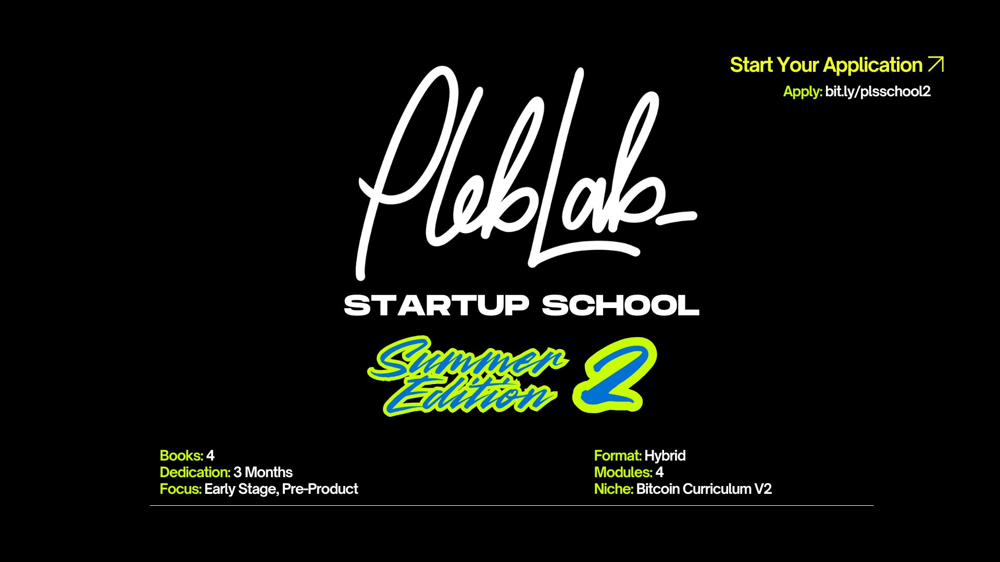

# PlebLab Main

## Dream • Build • Inspire
At **PlebLab**, we’re empowering the next generation of Bitcoin builders from our hackerspace and community accelerator in Austin, Texas. It represents the belief that anyone can become a builder in the Bitcoin space—regardless of background, pedigree, or location. You don't need permission, just curiosity and tenacity. It’s DIY, sovereign, and collaborative. We cultivate a strong community of developers, hackers, creatives, and founders shipping open-source projects, startups, software, hardware, and code.

---

## 📚 PlebBook

Your field manual for Bitcoin & Lightning development. Start building, contribute to FOSS-first projects, and level-up fast.

---

## 🚀 Startup School • Summer Edition 2025

A four-month hybrid program (June–Sept 2025) packed with weekly coaching, workshops, and demo-day prep for early-stage Bitcoin startups.

- **Curriculum:** Foundation → Product → Revenue → Pitch  
- **Apply:** [bit.ly/plstartupschool](https://bit.ly/plstartupschool)

---

## 🚀 Startup School 2: Summer Edition

Three-month hybrid program for early-stage, pre-product founders and builders using the updated Bitcoin curriculum.

- **Books:** 4  
- **Dedication:** 3 months  
- **Format:** Hybrid  
- **Modules:** 4  
- **Niche:** Bitcoin Curriculum V2  
- **Apply:** [bit.ly/plsschool2](https://bit.ly/plsschool2)

---

## 🌴 Startup Day 2025 • October 9th, 10th, 11th

Bi-annual showcase once in Austin during SXSW and the summer coinciding with Mexico’s Bitcoin Block Party by **Yopaki**. Full-day keynotes, panels, and two pitch slots for early-stage founders.

- **Venue:** White Paper House
- **Tickets:** [$299 general / $199 students](https://www.pleblab.dev/blog-detail/pleblab-startup-day-yucatan-presented-by-yopaki)  
- **Speaker highlight:** Francisco (Keynote) + more TBA

---

## 💻 AI Startup Rodeo

A builder-focused AI x Bitcoin gathering during SXSW week for founders, developers, and operators shipping real products.

- **RSVP / Info:** [luma.com/ai-startup-rodeo](https://luma.com/ai-startup-rodeo)

---

## ✨ Top Builder • Season 2 (2024–25)

$10,000 in BTC for the one true Top Builder—plus mentorship, global exposure, and collaboration.  
*Presented by **Timestamp** | Sign-ups: Oct 28–Dec 31, 2024*

---

## 🛠️ Workshops

Live in-person deep dives with hackers, founders, engineers, and open-source builders.  
Check the [📍 Luma calendar](https://lu.ma/calendar/cal-Kz7zAdSpmjwG4Sp) for the next session.

---

## 🏆 Hackathons

From 24-hour code-sprints to weekend-builds—FOSS ethos, real Bitcoin problems, and prizes paid in sats.

---

## 🙌 Bitcoin Builders Club

PlebLab sprouted from the [**Austin Bitcoin Club**](https://youtu.be/FcaQ-EifEJY?si=wfNThDlGVw1PAqEB) and now fuels a monthly meetup with [@BTCBuildersClub](https://x.com/BTCBuildersClub), hosted at Capital Factory.

Since summer 2025, we’ve been creating a recurring event that fits Austin’s vibrant tech community—bridging Bitcoin and builder culture where people gather day and night, online and IRL, for meetups, classes, and co-working. [RSVP for the latest one.](https://lu.ma/calendar/cal-a9wRNBLgALnsGj9)

> 💡 [Why Lifting Up Matters: Every Founder Starts Somewhere](https://pulse.pleblab.dev/why-lifting-up-matters-every-founder-starts-somewhere/) by Car, Co-founder of PlebLab

---

## 🍗 Plebsgiving 2025

Save the date—**Nov 15, 2025 | 5–8 PM**  
A family-style dinner at the hackerspace to celebrate community, share a meal, and carry on the Plebsgiving tradition we've upheld since 2021.

---

## 📺 PlebTV 

Bitcoin-native media platform.  
Early beta dropping soonish, peep the alpha release → [PlebTV](https://plebtv.com)

---

## ⚡️ Watch Live & On-Demand

- **YouTube:** [@pleblab](https://www.youtube.com/@pleblab)  
- **Twitch:** [twitch.tv/pleblab](https://www.twitch.tv/pleblab)  
- **Zap.Stream:** [zap.stream profile](https://zap.stream/p/npub1an84q6c03wml5lf0uwcqcr20ydwv0t0lvv0xktlcfs9seattef8sdhz6yg)

---

## 🔗 Stay Connected
- **Twitter / X:** [@pleblab](https://twitter.com/pleblab)  
- **Podcast (Early Days):** [Linktree](https://linktr.ee/earlydays21)  
- **Newsletter:** [Subscribe](https://dashboard.mailerlite.com/forms/10467/51078046840522216/share)  
- **Merch:** [merch.pleblab.dev](https://merch.pleblab.dev/)  
- **Apply to Hackerspace:** [bit.ly/applytohackerspace](https://bit.ly/applytohackerspace)

---

## 🤝 Get Involved
*Host a workshop • Visit the lab • Pitch your project/startup • Find fellow like minded builders.*  
📧 Email: [hello@pleblab.com](mailto:hello@pleblab.com)

---

## ⚡️ Support the Lab

> Every sat supports rent, hardware, and building a community accelerator driven by hackers, creatives, and founders.  
Donate here → [https://bit.ly/pl145](https://bit.ly/pl145)
